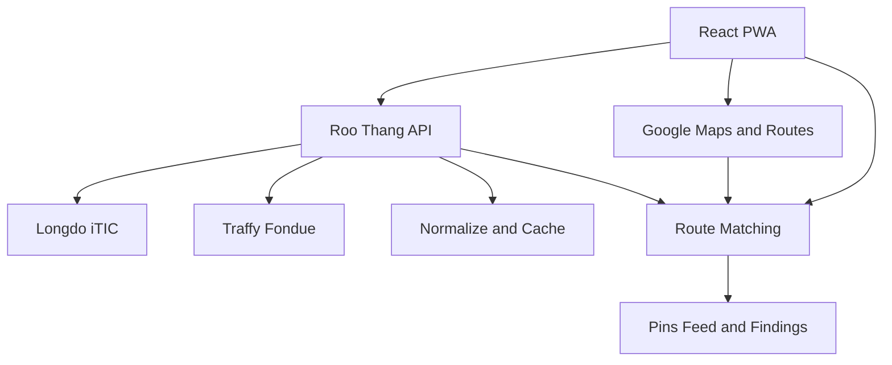

# รู้ทาง — PWA Implementation Plan

> PWA สำหรับค้นหาเส้นทางและดูรายงานเหตุการณ์จาก Longdo/iTIC และ Traffy Fondue ทั้งตามแนวเส้นทางและบริเวณใกล้ผู้ใช้


## 1. App Identity

| Field               | Value                               |
| ------------------- | ----------------------------------- |
| ชื่อแอป             | รู้ทาง                              |
| Internal name       | `roo-thang`                         |
| Product description | ดูสิ่งที่จะเจอตลอดเส้นทาง           |
| Heading font        | Prompt                              |
| Body font           | Sarabun                             |
| App icon            | `assets/ru-thang-app-icon-1024.png` |

ใช้ `รู้ทาง` ใน UI และใช้ `roo-thang` สำหรับ repository, package และ identifiers ภายในโค้ด

## 2. MVP Goal

MVP มีเพียง 2 เมนู:

1. **แผนที่** — เลือกต้นทาง/ปลายทาง ดูเส้นทาง และดูว่ามีรายงานเหตุการณ์อะไรใกล้เส้นทาง
2. **ใกล้ฉัน** — Feed เหตุการณ์รอบตำแหน่งปัจจุบัน เรียงจากใกล้ไปไกล

หมวดหลัก: น้ำท่วม อุบัติเหตุ รถเสีย ถนนชำรุด/หลุม งานก่อสร้าง สิ่งกีดขวาง เหตุควรระวัง เพลิงไหม้ และฝนที่ถูกรายงานเป็นเหตุการณ์

ทุกข้อความต้องใช้คำว่า **“มีรายงาน”** และห้ามรับรองว่าเส้นทางปลอดภัยหรือผ่านได้แน่นอน

## 3. Confirmed Scope

- Mobile-first Progressive Web App
- React + TypeScript + Vite
- Google Maps JavaScript API สำหรับแผนที่
- Google Routes API สำหรับเส้นทางรถยนต์และเส้นทางสำรอง
- Google Places API สำหรับค้นหาสถานที่
- Browser Geolocation สำหรับตำแหน่งผู้ใช้
- Longdo/iTIC Event Feed และ Traffy Fondue GeoJSON
- Backend proxy สำหรับ normalize, cache และ partial failure
- **ไม่ใช้ Longdo Traffic Status**
- ไม่มี login, database, Qwen, Weather, Risk Score, Vehicle Profile, Drive Mode หรือเสียงนำทางใน MVP

## 4. Technology Stack

### Frontend

- React, TypeScript strict, Vite
- React Router
- `@googlemaps/js-api-loader`
- Turf modules ที่จำเป็น เช่น `nearest-point-on-line`
- `vite-plugin-pwa`
- CSS Modules/CSS design tokens
- Vitest + React Testing Library
- Playwright สำหรับ critical flows

### Backend

- TypeScript serverless functions
- เริ่มด้วย Vercel Functions เพื่อ deploy ร่วมกับ PWA ได้เร็ว
- API ของเราอยู่ใต้ `/api/v1`

### Storage

- `localStorage` เฉพาะ preferences และปลายทางล่าสุด
- Service Worker cache เฉพาะ app shell/static assets
- ไม่เก็บตำแหน่งละเอียดหรือ route history เป็นค่าเริ่มต้น
- ไม่มี database ใน MVP

## 5. External Setup

### Google Cloud

- สร้าง project และเปิด Billing
- เปิด Maps JavaScript API, Routes API และ Places API
- สร้าง browser API key
- จำกัด key ด้วย HTTP referrers และ API restrictions
- ตั้ง quota และ budget alert

```text
VITE_GOOGLE_MAPS_API_KEY=
VITE_GOOGLE_MAP_ID=
```

`VITE_*` มองเห็นจาก browser จึงต้องป้องกันด้วย restrictions ห้ามถือว่าเป็น secret

### Provider readiness

ก่อน production ต้องยืนยัน license, attribution, rate limit, cache policy, SLA และสิทธิ์ใช้งานเชิงพาณิชย์กับ Longdo/iTIC และ Traffy/NECTEC

## 6. Data Sources

### Longdo/iTIC

```text
GET https://event.longdo.com/feed/json
```

| Type | Category            |
| ---: | ------------------- |
|    1 | `vehicle_breakdown` |
|    2 | `construction`      |
|    3 | `accident`          |
|    5 | `rain`              |
|    6 | `flood`             |
|   10 | `traffic_incident`  |
|   12 | `caution`           |
|   15 | `fire`              |

### Traffy Fondue

```text
GET https://publicapi.traffy.in.th/teamchadchart-stat-api/geojson/v2
GET https://publicapi.traffy.in.th/teamchadchart-stat-api/category/v2
```

ใช้เฉพาะหมวดที่กระทบการเดินทาง เช่น น้ำท่วม ถนน/ผิวจราจร หลุม ฝาท่อ สิ่งกีดขวาง และงานก่อสร้าง ต้องตรวจ payload fixture จริงก่อนล็อก mapping ของหมวดและสถานะ

UI และ route logic ห้าม parse raw provider payload โดยตรง ทุกแหล่งต้องผ่าน adapter

## 7. Architecture



### Frontend

- แสดงแผนที่ ค้นหาสถานที่ และวาด routes
- โหลด normalized incidents จาก Backend
- จับคู่ incidents กับ route และเรียงตามลำดับที่จะพบ
- แสดง selected-route pins, route findings และ Nearby feed
- รองรับ loading, empty, partial-data และ offline states

### Backend

- เรียก provider พร้อม timeout
- Validate, normalize และ filter payload
- ตัด resolved/expired เมื่อ provider ระบุได้ชัดเจน
- Cache ระยะสั้นและลดการยิง provider ซ้ำ
- คืนข้อมูลจาก provider ที่ยังทำงานได้เมื่ออีกแหล่งล้มเหลว
- ไม่รับหรือ log ตำแหน่งผู้ใช้เกินกว่าที่จำเป็นต่อ request

## 8. API Contract

### `GET /api/v1/incidents`

Query: `north`, `south`, `east`, `west` และ optional `categories`

```ts
interface IncidentsResponse {
  data: RoadIncident[];
  meta: {
    generatedAt: string;
    partial: boolean;
    providers: Array<{
      provider: 'longdo' | 'traffy';
      status: 'ok' | 'unavailable' | 'stale';
      fetchedAt?: string;
    }>;
  };
}
```

Rules:

- Validate coordinates และจำกัดขนาด bounding box
- ตั้ง timeout แยกต่อ provider
- Provider หนึ่งล้มเหลว: ตอบ `200`, ข้อมูลที่เหลือ และ `partial: true`
- ทุก provider ล้มเหลว: ตอบ error schema ที่ UI เข้าใจ
- Cache ประมาณ 2–5 นาที แล้วปรับจาก usage จริง

## 9. Domain Model

```ts
export type IncidentProvider = 'longdo' | 'traffy';
export type IncidentStatus = 'active' | 'resolved' | 'expired' | 'unknown';
export type IncidentCategory =
  | 'flood'
  | 'accident'
  | 'vehicle_breakdown'
  | 'road_damage'
  | 'construction'
  | 'obstruction'
  | 'traffic_incident'
  | 'rain'
  | 'fire'
  | 'caution'
  | 'other';

export interface RoadIncident {
  id: string; // provider:externalId
  provider: IncidentProvider;
  externalId: string;
  category: IncidentCategory;
  title: string;
  description?: string;
  latitude: number;
  longitude: number;
  status: IncidentStatus;
  severity?: number;
  reportedAt?: string;
  updatedAt?: string;
  expiresAt?: string;
  sourceUrl?: string;
}

export interface RouteIncidentMatch {
  incident: RoadIncident;
  routeId: string;
  distanceFromRouteMeters: number;
  distanceFromStartMeters: number;
  distanceAheadMeters?: number;
  matchReason: 'within_corridor' | 'near_route_start' | 'near_route_end';
}
```

## 10. User Flows

### Map

1. โหลด app shell และแผนที่
2. ขอ location เมื่อต้องใช้; ถ้าปฏิเสธให้เริ่มที่กรุงเทพฯ
3. ผู้ใช้เลือกต้นทาง/ปลายทางผ่าน Places autocomplete
4. Routes API คืน route หลักและทางเลือก
5. โหลด incidents สำหรับ route bounding box พร้อม padding
6. จับคู่ incidents กับแต่ละ route
7. เลือก route แรกเป็นค่าเริ่มต้น
8. แสดงเฉพาะ pins ของ route ที่เลือก พร้อมเวลา ระยะทาง และ findings
9. เปลี่ยน route แล้ว polyline, pins และ findings ต้องเปลี่ยนพร้อมกัน

### Nearby feed

1. เปิดแท็บ **ใกล้ฉัน**
2. ใช้ Browser Geolocation
3. โหลด incidents รอบตำแหน่ง
4. คำนวณ Haversine distance
5. แสดงภายใน 10 กม. เรียงใกล้ไปไกล
6. กรอง category ได้
7. แตะ card เพื่อดูรายละเอียด/ตำแหน่งบนแผนที่
8. ถ้าปฏิเสธ location ให้เลือกพื้นที่จากแผนที่แทน

## 11. Route Matching

1. แปลง route path เป็น GeoJSON `LineString`
2. ใช้ `nearestPointOnLine` หา segment ที่ใกล้ที่สุด
3. คำนวณระยะจาก incident ถึง route
4. รับเฉพาะจุดภายใน corridor ของ category
5. คำนวณระยะตามแนว route จากจุดเริ่มต้น
6. เรียงจาก `distanceFromStartMeters`
7. เก็บค่าที่ใช้ match สำหรับ debug/test

| Category                      | Initial corridor |
| ----------------------------- | ---------------: |
| ถนนชำรุด/หลุม                 |            150 m |
| อุบัติเหตุ/รถเสีย/สิ่งกีดขวาง |            300 m |
| น้ำท่วม/ฝน/เพลิงไหม้          |            500 m |
| อื่น ๆ                        |            300 m |

ค่าทั้งหมดต้องอยู่ใน config เดียว ระยะอย่างเดียวไม่ยืนยันถนน/ทิศทาง จึงต้องใช้คำว่า “ใกล้เส้นทาง” และมี fixture สำหรับถนนคู่ขนาน

## 12. Freshness and Deduplication

- ตัด Longdo event ที่ `stop` ผ่านไปแล้วเมื่อเวลาเชื่อถือได้
- ตัด Traffy report ที่ปิด/แก้ไขแล้วอย่างชัดเจน
- Unknown status ต้องแสดง timestamp หรือ “ไม่ทราบเวลาอัปเดต”
- ห้ามเรียกข้อมูลเก่าว่า real-time
- แจ้งผู้ใช้เมื่อข้อมูลจาก provider ใดขาดหาย

Candidate duplicate ต้อง category ใกล้เคียง, พิกัดใกล้กัน (เริ่มที่ 100 ม.), เวลาใกล้กัน และข้อความคล้ายกัน หากไม่มั่นใจให้ไม่ merge แทนการรวมผิดเหตุการณ์

## 13. UI Requirements

- Prompt สำหรับหัวข้อ; Sarabun สำหรับเนื้อหา
- Bottom navigation 2 เมนู: **แผนที่**, **ใกล้ฉัน**
- Touch target อย่างน้อย 44 × 44 px; primary action สูงอย่างน้อย 52 px
- ไม่ใช้สีเป็นสัญญาณเพียงอย่างเดียว
- Map screen มี route form, map, pins, route result sheet และ incident detail
- Feed มี filter chips และ cards ที่แสดง category, source, time, distance
- มี loading, empty, error, permission-denied, partial-data และ offline states
- เป็นเครื่องมือวางแผนก่อนเดินทาง ไม่ใช่ turn-by-turn navigation

## 14. Project Structure

```text
roo-thang/
├── api/v1/incidents.ts
├── public/
│   ├── icons/
│   └── manifest.webmanifest
├── src/
│   ├── app/
│   ├── components/{map,incident,common}/
│   ├── features/{route-planner,nearby-feed}/
│   ├── services/{google-maps,incidents}/
│   ├── domain/{incident,route,matching}/
│   ├── styles/
│   └── test/{fixtures,setup}/
├── server/
│   ├── providers/{longdo,traffy}.ts
│   ├── normalization/
│   └── validation/
├── tests/e2e/
├── AGENTS.md
├── IMPLEMENTATION_PLAN.md
└── UI_DESIGN.md
```

## 15. PWA, Security and Privacy

- Manifest ใช้ชื่อ “รู้ทาง”, theme color และ app icons
- Cache เฉพาะ app shell; map/routes/incident data ต้องออนไลน์
- Cached incident ต้องมี timestamp ชัดเจน
- รองรับ safe-area และ standalone mode
- จำกัด Google key ด้วย referrer/API restrictions
- ไม่ commit `.env` หรือ credentials
- Validate input, จำกัด response size, timeout และ rate limit
- Sanitize provider text; ห้ามใช้ `dangerouslySetInnerHTML`
- ไม่เก็บ/log ตำแหน่งและ origin/destination แบบละเอียดใน production
- มี Privacy Policy ก่อน production

## 16. Required Tests

### Unit/integration

- Longdo/Traffy normalization และ unknown category
- Missing/invalid coordinates
- Resolved/expired filtering
- Haversine distance
- Category corridor และ route progression
- Incident order
- Parallel-road false positive
- Candidate deduplication
- Bounding-box validation
- Provider timeout/partial failure/cache metadata

### Playwright

1. ปฏิเสธ location แล้วยังค้นหา route ได้
2. ค้นหา route แล้วเห็น findings
3. เปลี่ยน route แล้ว pins/findings เปลี่ยนพร้อมกัน
4. เปิด Feed กรอง category และดู detail
5. Provider ล้มเหลวหนึ่งแหล่งแต่แอปยังใช้ได้
6. Offline แล้วแสดงสถานะถูกต้อง

Mock Google/provider responses ใน automated tests เพื่อให้ deterministic และไม่สร้างค่า API

## 17. Implementation Phases

### Phase 0 — Foundation

- [ ] ปรับ `UI_DESIGN.md` และ `AGENTS.md` จาก Swift เป็น PWA
- [ ] สร้าง Vite React TypeScript project และ strict mode
- [ ] ตั้ง ESLint, Vitest, Playwright และ CI
- [ ] เพิ่ม Prompt/Sarabun, design tokens, responsive shell
- [ ] เพิ่ม manifest, icons, service worker และ `.env.example`
- [ ] สร้าง domain interfaces และ deterministic fixtures

**Exit:** app shell install ได้, responsive, fonts/icon ถูกต้อง และ lint/typecheck/tests ผ่าน

### Phase 1 — UI with mocks

- [ ] สร้าง Map/Nearby tabs
- [ ] สร้าง route form, mock map, markers, sheets และ Feed
- [ ] ครบ loading/empty/error/permission/partial states

**Exit:** เดโมทุก flow ด้วย fixture โดยไม่เรียก production APIs

### Phase 2 — Google Maps and Routes

- [ ] Lazy-load Maps JavaScript API
- [ ] เชื่อม Geolocation และ Places autocomplete
- [ ] ขอ primary/alternative routes
- [ ] วาด/เลือก route และ fit camera
- [ ] ซ่อน Google-dependent code หลัง interfaces เพื่อ mock ได้

**Exit:** ค้นหา route จริง เลือก route และเห็น ETA/ระยะทาง

### Phase 3 — Incident Backend

- [ ] สร้าง `/api/v1/incidents`
- [ ] สร้าง Longdo/Traffy adapters
- [ ] Validate, normalize, filter, cache
- [ ] รองรับ timeout, partial failure และ attribution

**Exit:** Frontend ได้ normalized incidents จาก API เดียว

### Phase 4 — Matching and Feed

- [ ] Route corridor, progression และ encounter order
- [ ] Deduplication candidates
- [ ] Selected-route markers/findings
- [ ] Nearby distance/filter/detail
- [ ] Parallel-road fixtures

**Exit:** เปลี่ยน route แล้วผลเปลี่ยนถูกต้อง; Feed เรียงระยะได้

### Phase 5 — Release

- [x] Accessibility และ performance audit (local; ดู `RELEASE_READINESS.md`)
- [ ] ทดสอบ iOS Safari, Android Chrome, desktop และ standalone — ทดสอบแล้วเฉพาะ Chromium/WebKit emulation และ desktop Chromium ยังไม่ทดสอบบนอุปกรณ์จริง
- [ ] Security headers, rate limit, monitoring — มี headers (CSP แบบ report-only) และ rate limit ต่อ instance แล้ว ยังไม่มี monitoring และ global rate limit
- [ ] Google quota/budget alerts
- [ ] ยืนยัน provider permissions/attribution
- [ ] Privacy Policy ที่ได้รับการอนุมัติ
- [ ] Deploy preview และ production

## 18. MVP Acceptance Criteria

- เปิด PWA และดูแผนที่ได้
- ค้นหาต้นทาง/ปลายทางและเลือก route ได้
- แสดง route หลัก/ทางเลือกเมื่อมี
- Normalize Longdo/iTIC และ Traffy เป็น model เดียว
- ไม่เรียก Longdo Traffic Status
- แสดงเฉพาะ incidents ที่เกี่ยวข้องกับ selected route
- Findings เรียงตามลำดับที่จะพบ
- Detail แสดง source และ timestamp
- Feed ใกล้ฉันเรียงระยะและกรอง category ได้
- Resolved/expired ที่ระบุได้ไม่แสดงเป็น active
- Provider หนึ่งล้มเหลว แอปยังทำงานพร้อม warning
- เมื่อไม่พบรายงาน ไม่กล่าวว่า route ปลอดภัย
- App shell เปิด offline และ PWA install ได้
- Critical tests ผ่านและไม่มี production credential ใน repo

## 19. Deferred

- Google Weather API และ sampling ตาม route
- Risk score/route recommendation
- Vehicle Profile สำหรับรถโหลดเตี้ย
- Qwen summary
- Drive Mode, voice, push notifications
- Login, database, synced favorites/history
- Crowdsourced confirmation

## 20. Codex Start Prompt

```text
Read AGENTS.md, IMPLEMENTATION_PLAN.md and UI_DESIGN.md completely.
The current product direction is a PWA. If AGENTS.md or UI_DESIGN.md still
describes Swift, update those documents to match this plan before coding.

Implement Phase 0 only. Create the React + TypeScript + Vite foundation,
two-tab responsive shell, Prompt/Sarabun typography, existing app icon,
PWA manifest, safe-area support, domain interfaces, fixtures, tests and
.env.example.

Do not call production APIs yet. Do not add Weather, Qwen, authentication,
database, risk scoring or Drive Mode. Run lint, typecheck and tests and report
changed files, commands, results and blockers.
```

## 21. Definition of Done

ผู้ใช้ค้นหาเส้นทางจริง เห็นรายงานที่อาจพบตามแนว route เปิดรายละเอียดพร้อมแหล่งข้อมูล/เวลา และดู Feed ใกล้ฉันได้ โดยระบบจัดการข้อมูลขาดหาย network failure และความไม่แน่นอนอย่างตรงไปตรงมา
